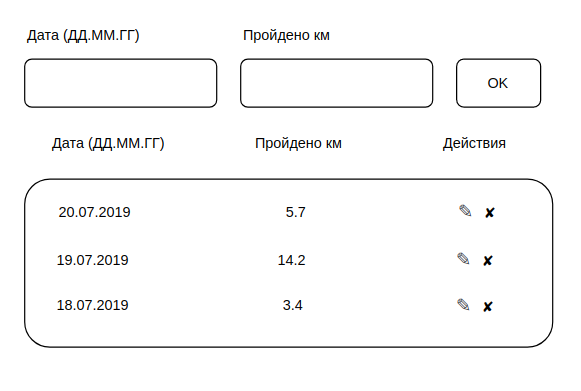

Учёт тренировок
===

# Приложение, которое хранит данные о тренировках и прогулках в течение недели.

Общий интерфейс выглядит следующим образом:

## Добавление данных

В форму вводится дата и количество пройденных километров. Новые значения добавляются в таблицу при отправке формы.

_Особенности добавления_:
1. Новые значения добавляются не в конец, а согласно сортировке по дате, то есть если мы добавим 21.07.20, то значение встанет на первую позицию, согласно скриншоту, а если 17.07.2019 — то на последнюю.
2. Если мы добавляем значения, указывая уже существующую дату, то значения суммируются с теми, что хранятся в таблице, например, если добавить 20.07.2019 и 10 км, то для даты 20.07.2019 будет отображаться 15.7 км.

## Удаление данных

С помощью иконки ✘ удаляется строка. Удаляется вся строка целиком и данные, связанные с ней.

## Редактирование данных

С помощью иконки редактирования ✎, при нажатии на нее происходит перенос данных в форму ввода с последующим сохранением при нажатии кнопки Ok.
